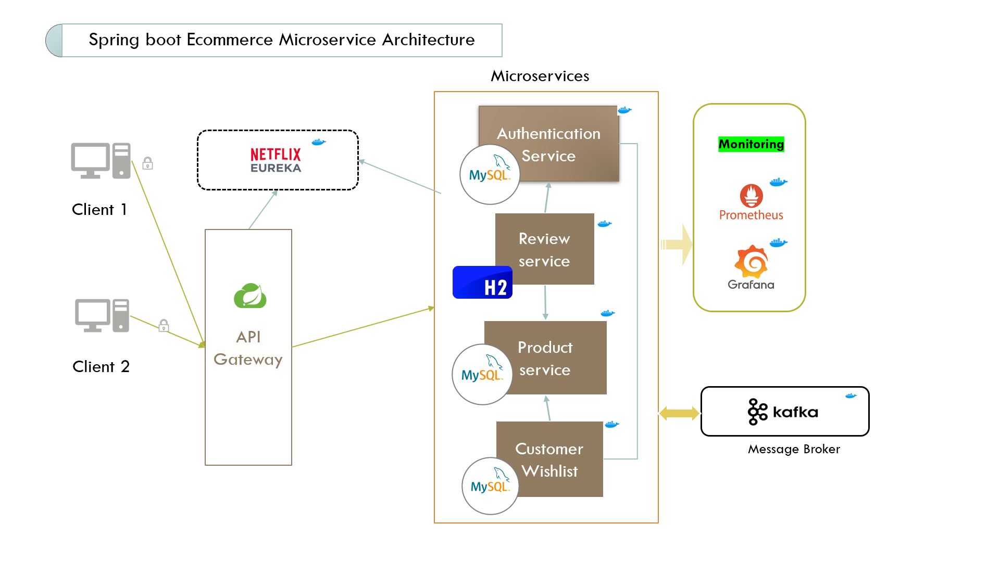

## Spring boot Ecommerce microservices project:

Building a scalable and efficient E-commerce application using microservices architecture to manage complex business logic and user interactions across multiple services.

Developed a Spring Boot-based E-commerce application with distinct microservices (Product, Cart, Order, Payment) and different databases, ensuring modularity, independent scaling, and optimized performance.

## Architecture diagram

### Team members

